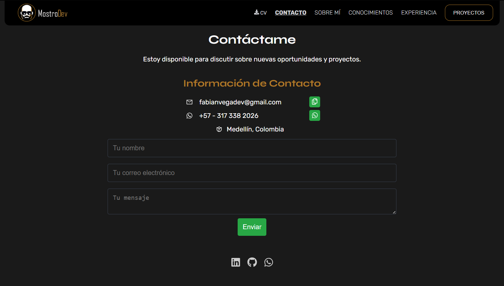

# Portafolio de Fabian Velasquez

Bienvenido a mi portafolio web, desarrollado para presentar mis habilidades, proyectos y experiencia en desarrollo de software. Mi enfoque es la calidad en el desarrollo de software, combinando precisión y creatividad para generar soluciones tecnológicas efectivas.

## Capturas de Pantalla

|  |  |
| -------------------------------------------- | -------------------------------------------- |
| **Pantalla principal**                       | **Formulario de contacto**                   |

## 🌟 Características

- **Inicio y Navegación Suave:** Un diseño limpio con navegación fluida entre secciones, utilizando scroll smooth para una experiencia más dinámica.
- **Sección 'Sobre Mí':** Incluye información sobre mi formación y experiencia profesional, destacando mi interés en el desarrollo de software y proyectos personales.
- **Experiencia:** Organizada en secciones que incluyen mis experiencias técnicas y otros trabajos, con detalles claros de cada puesto.
- **Proyectos:** Una muestra de mis principales proyectos, cada uno con una descripción, las tecnologías utilizadas y enlaces a repositorios o demostraciones.
- **Habilidades y Tecnologías:** Lista de herramientas y lenguajes de programación en los que tengo experiencia, presentadas con transiciones suaves que destacan cada habilidad.
- **Contacto:** Un formulario para que los visitantes puedan contactarme, implementado con EmailJS para envío de mensajes.

## 🚀 Tecnologías Utilizadas

- **Frontend:** React para la construcción de componentes y el manejo de la interfaz.
- **CSS:** Para el diseño y estilo, utilizando fuentes **Syne** y **Rubik** con un esquema de color característico (#AF7927 y #000) y letras en blanco.
- **EmailJS:** Para la funcionalidad de envío de mensajes en la sección de contacto.
- **GitHub Pages:** Utilizado para desplegar el portafolio y permitir su visualización en línea.
- **Vite:** Utilizado como herramienta de construcción y desarrollo.
- **JavaScript, HTML5, CSS3:** Lenguajes base para el desarrollo de las interfaces.
- **Herramientas de Desarrollo:** Visual Studio Code, Git/GitHub para control de versiones, y Postman y Azure DevOps en otros proyectos.
